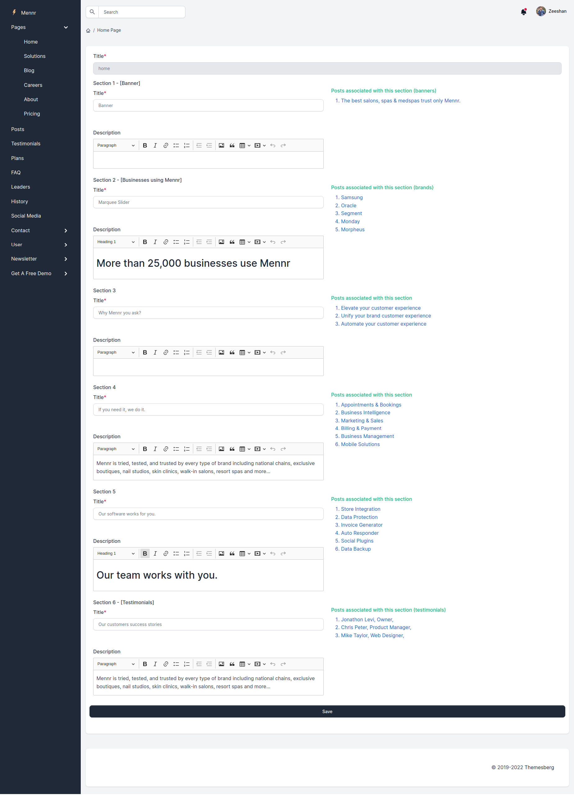
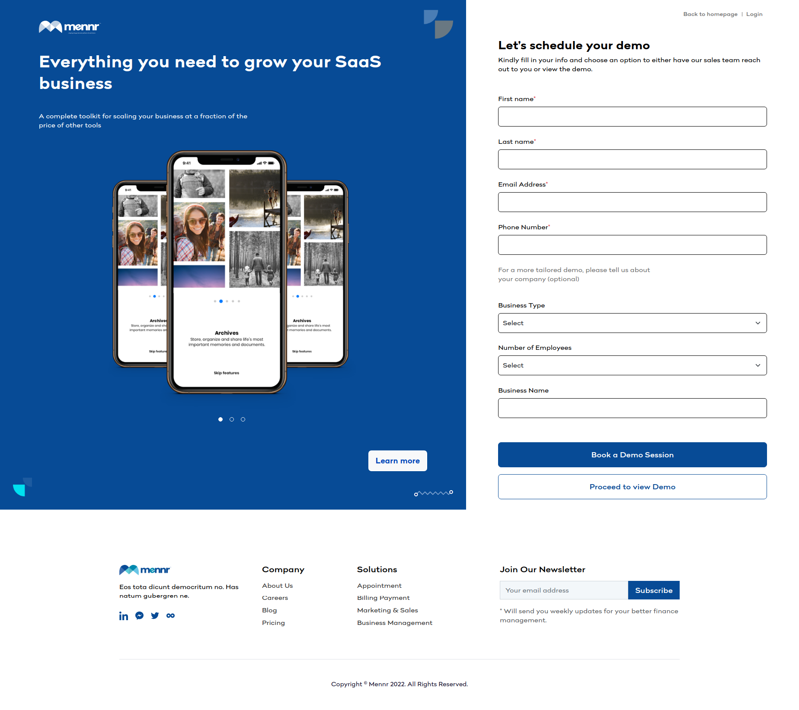
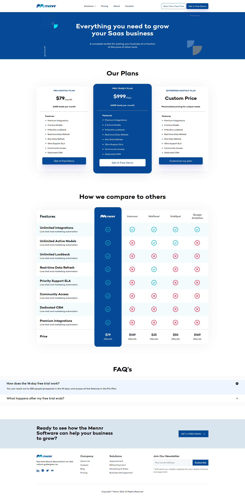

## Mennr Project 

### Specs & Features
- Laravel v8 + MySQL/MariaDB

- CMS - Content Management System

- Get A Free Demo

- Blog
- Pricing Plans


Here is the steps to make local setup for this project

- Copy .env.example to .env and update db credentials
- Run composer
 ``` composer install ```
- Run database migrations
```php artisan migrate ```
- Run seeds
 ``` php artisan db:seed --class=AdminTableSeeder ```

It will enable admin user with password admin123 OR complete database can be import from db folder
